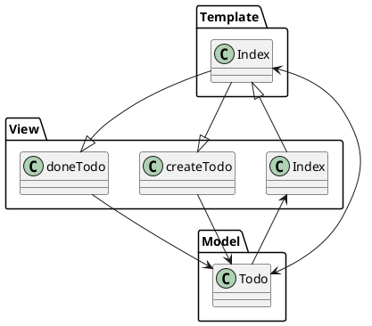

## PlantUML

* 대부분을 Markdown으로 작성하면서 텍스트 위주의 편집에 점점 익숙해져 가면서 자연스럽게 그래프와 차트도 텍스트 기반으로 작성 할 수 없을까라는 고민을 하게 된다.
* 텍스트 기반으로 작성한다면 git에서도 형상관리가 가능해진다.
* [plant uml activity diagram](https://plantuml.com/ko/activity-diagram-beta)

## Chapter2 TodoList
* Index 페이지에서 모든 컨트롤(View.py)를 해결하는 간단한 App

